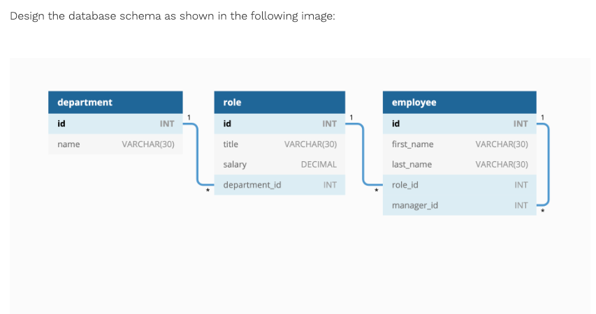
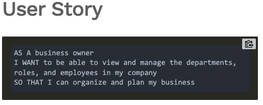
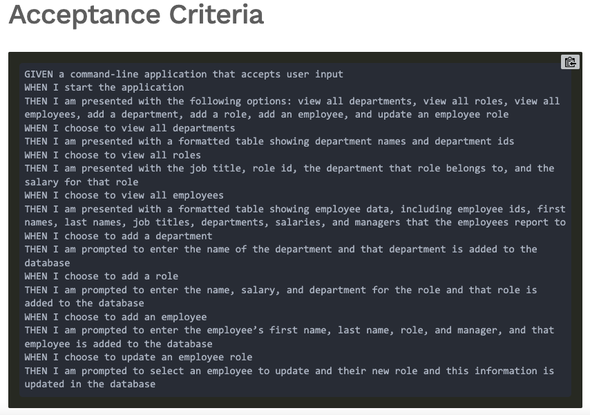

# employee-tracket-sql

# Table of Contents 
* [Description](#description) 
* [Installation](#installation)
* [License](#license)
* [Contributing](#contributing)
* [Questions](#questions)
        
## Description 
Developers frequently have to create interfaces that allow non-developers to easily view and interact with information stored in databases. These interfaces are called content management systems (CMS). Your assignment this week is to build a command-line application from scratch to manage a company’s employee database, using Node.js, Inquirer, and MySQL.

Because this application won’t be deployed, you’ll also need to create a walkthrough video that demonstrates its functionality and all of the following acceptance criteria being met. You’ll need to submit a link to the video and add it to the README of your project.

## Mock-Up

### User Story 

### Acceptance Criteria 

## Walkthrough 

## Installation
to use this application one must install express 
  npm install express
  npm install inquirer
  install mysql2

## License 
MIT license 
## Contributing 
William Wright was sole contributer 

## Questions
if you have any questions you can reach out to me via email at wrightw404@gmail.com 